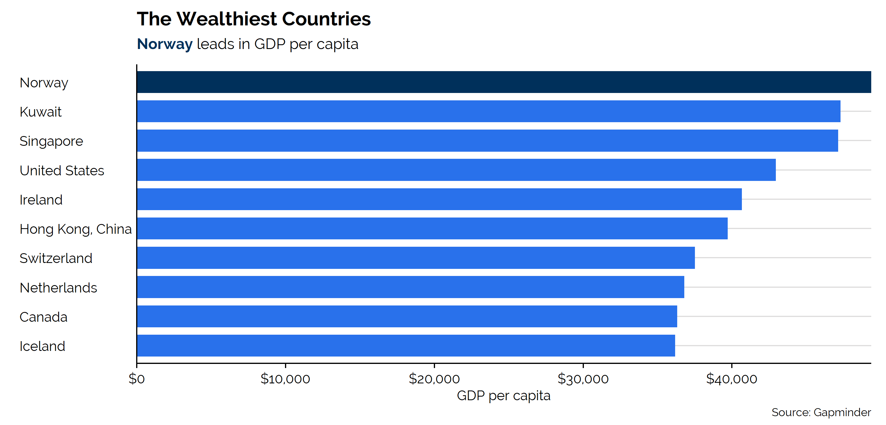
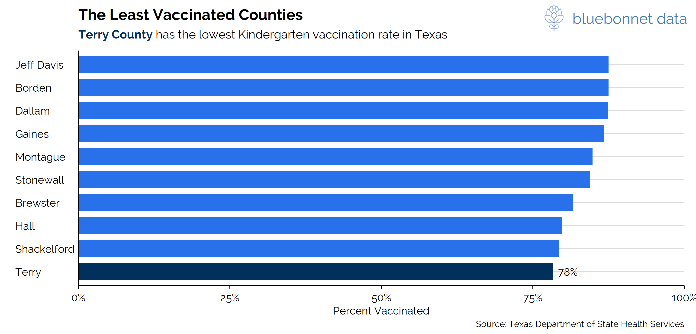

# README

## Examples

``` r
library(tidyverse)
library(ggplot2)

#devtools::install_github("connorrothschild/bbdata")
library(bbdata)
library(gapminder)

bbd_font_install(device = 'win', force = TRUE)

data <- gapminder %>% 
  dplyr::filter(gapminder$country %in% c("Italy", "Japan", "Norway", "Mexico", "United States")) %>%
  dplyr::mutate(year = as.Date(paste(year, "-01-01", sep = "", format='%Y-%b-%d')))
```

``` r
set_bbd_theme()

ggplot(data = data, aes(x = year, y = gdpPercap/1000, fill = country)) +
  geom_area() +
  scale_x_date(expand = c(0,0)) +
  bbd_fix_bars() +
  labs(title = "GDP Per Capita Over Time",
       subtitle = "Using the BBD Color Palette",
       x = "Year",
       y = "GDP Per Capita\n(thousands of $)",
       fill = "Country",
       caption = "Source: Gapminder")
```


### An example using `ggtext`:

``` r
#devtools::install_github("clauswilke/ggtext")
library(ggtext)

data <- gapminder %>% 
  filter(year == 2007) %>% 
  mutate(rank = rank(gdpPercap)) %>% 
  filter(rank > 132)

ggplot(data, aes(x = reorder(country, gdpPercap), 
                 y = gdpPercap, 
                 fill = ifelse(country == "Norway", "1", "0"))) +
  geom_col(show.legend = FALSE) +
  scale_y_continuous(expand = c(0, 0), labels = scales::dollar) +
  coord_flip() +
  labs(y = "GDP per capita",
       x = element_blank(),
       title = "The Wealthiest Countries",
       subtitle = "<span style='color:#00315B'>**Norway**</span> leads in GDP per capita",
       caption = "Source: Gapminder") +
  theme(plot.subtitle = element_markdown(lineheight = 1.1))
```



## Add the Bluebonnet Logo

``` r
set_bbd_theme(style = "Texas")

tx_vac <- readr::read_csv("https://raw.githubusercontent.com/connorrothschild/tpltheme/master/data/tx_vac_example.csv")
plot <- ggplot(data = tx_vac, aes(x = tx_vac$long, 
                                  y = tx_vac$lat, 
                                  group = tx_vac$group, 
                                  fill = tx_vac$avgvac * 100)) + 
              coord_fixed(1.3) + 
              geom_polygon(color = "black") + 
              labs(title = "Texas Vaccination Rate by County", 
                   subtitle = "Among Kindergarteners", 
                   fill = "Percent\nVaccinated")

add_bbd_logo(plot, scale = 1.5, position = "bottom right")
```


``` r
set_bbd_theme(style = "print")

tx_vac_low <- tx_vac %>%
  group_by(subregion) %>% 
  summarise(avgvac = mean(avgvac)) %>% 
  mutate(rank = rank(avgvac)) %>%
  filter(rank < 10) %>% 
  arrange(desc(avgvac)) %>% 
  mutate(subregion = str_to_title(subregion))

plot <- ggplot(data = tx_vac_low, aes(x = reorder(subregion, avgvac),
                                      y = avgvac,
                                      fill = ifelse(subregion == "Terry", "1", "0"))) + 
              geom_col(show.legend = FALSE) + 
              labs(title = "Texas Vaccination Rate by County", 
                   subtitle = "Among Kindergarteners") +
  coord_flip() + 
  geom_text(aes(label = ifelse(subregion == "Terry", paste0(100*round(tx_vac_low$avgvac, 2), "%"), '')), hjust = -.25) +
  scale_y_continuous(expand = c(0, 0), limits = c(0,1), labels = scales::percent) +
  labs(y = "Percent Vaccinated",
       x = element_blank(),
       title = "The Least Vaccinated Counties",
       subtitle = "<span style='color:#00315B'>**Terry County**</span> has the lowest Kindergarten vaccination rate in Texas",
       caption = "Source: Texas Department of State Health Services") +
  theme(plot.subtitle = element_markdown(lineheight = 1.1),
        legend.position = "none")

add_bbd_logo(plot, scale = 1.5)
```



### Palettes

``` r
p1 <- view_palette(palette = palette_bbd_main) + ggtitle("Categorical")
p2 <- view_palette(palette = palette_bbd_diverging) + ggtitle("Diverging")
p3 <- view_palette(palette = palette_bbd_sequential) + ggtitle("Sequential")

gridExtra::grid.arrange(p1, p2, p3, nrow = 1)
```


